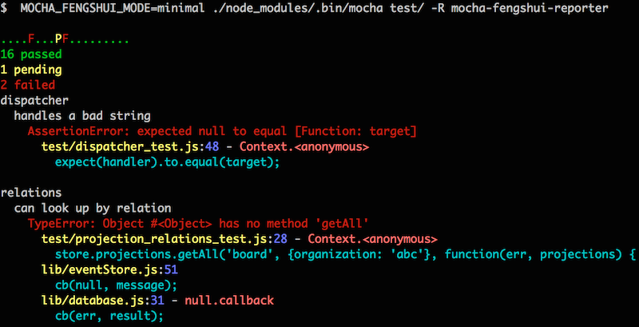
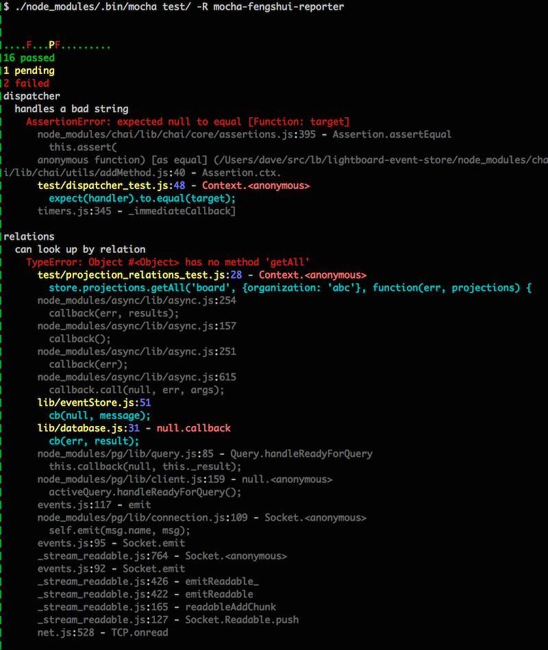

##Feng Shui Reporter for mocha

A slimmed down reporter for mocha that prints USEFUL stack traces:

* Focuses on code by hiding or deemphasizing stack frames in other modules or the mocha test framework itself
* Displays the contents of the line of code referenced in each frame

(See below for examples of output)

###install it:

```npm install mocha-fengshui-reporter --save-dev```

###to use it, use mocha's -R/--reporter argument:

```./node_modules/.bin/mocha test -R mocha-fengshui-reporter ```


#### configuration

The output mode for stack traces is set via env variable MOCHA_FENGSHUI_MODE

possible values: 

* default - display (gray) stack frames from npm modules and node internals
```./node_modules/.bin/mocha test -R mocha-fengshui-reporter ```

* minimal - only display stack frames from the local module (just 'my code')
```MOCHA_FENGSHUI_MODE=minimal ./node_modules/.bin/mocha test -R mocha-fengshui-reporter ```

####Example "minimal" output


####Example "default" output


